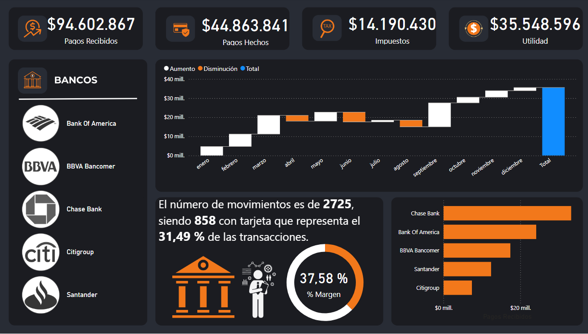
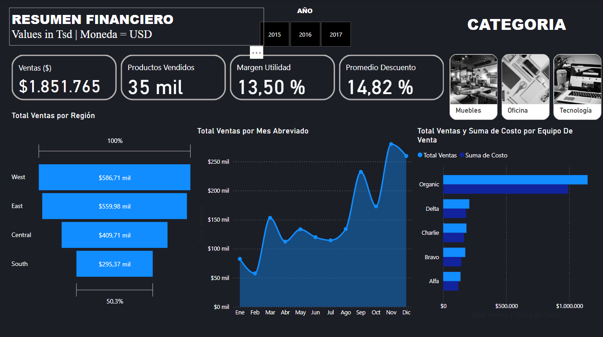
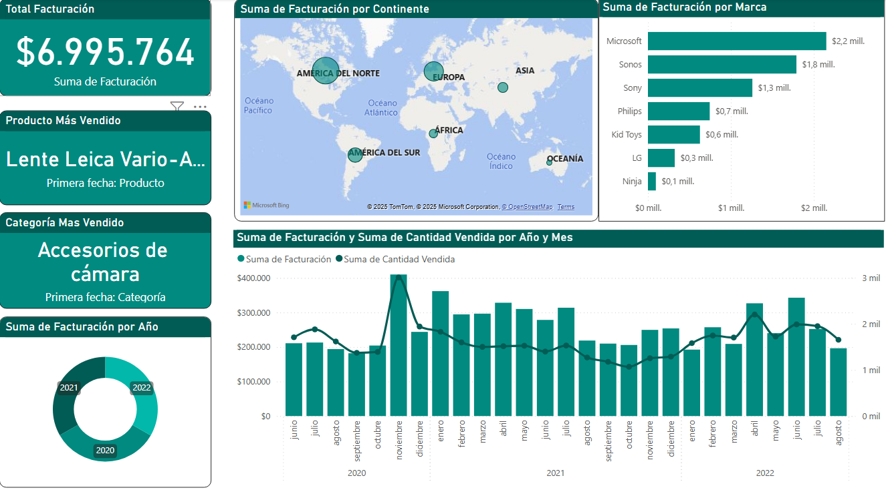
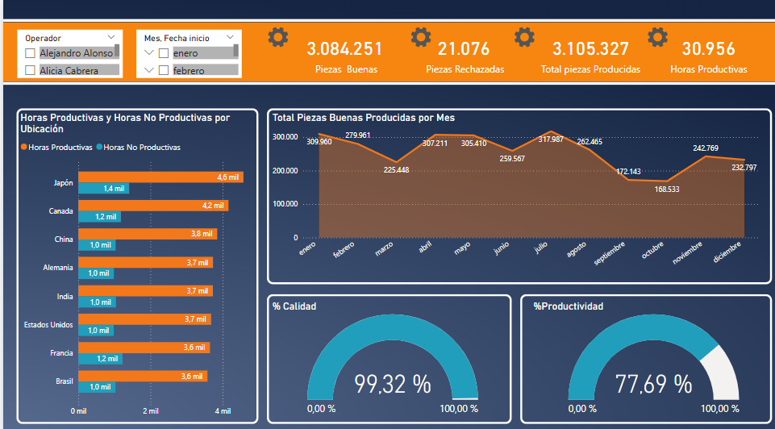

# Portafolio-PowerBI
Repositorio con paneles de control en Power BI sobre ventas, finanzas y producción. Utiliza DAX para cálculos avanzados y modelado de datos. Incluye visualizaciones interactivas que optimizan el análisis y la toma de decisiones estratégicas

