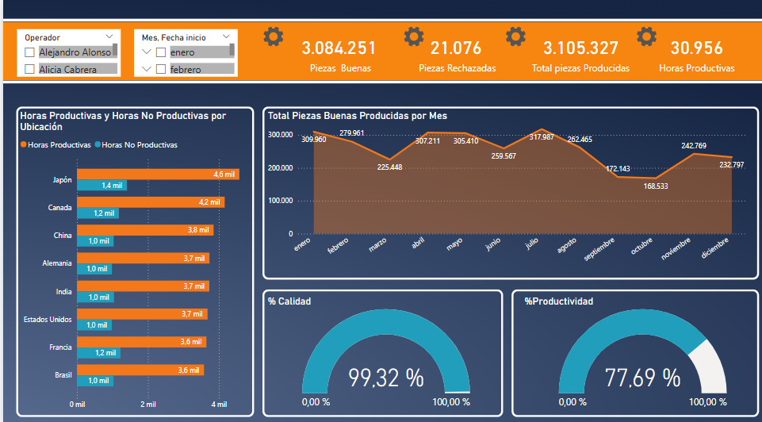
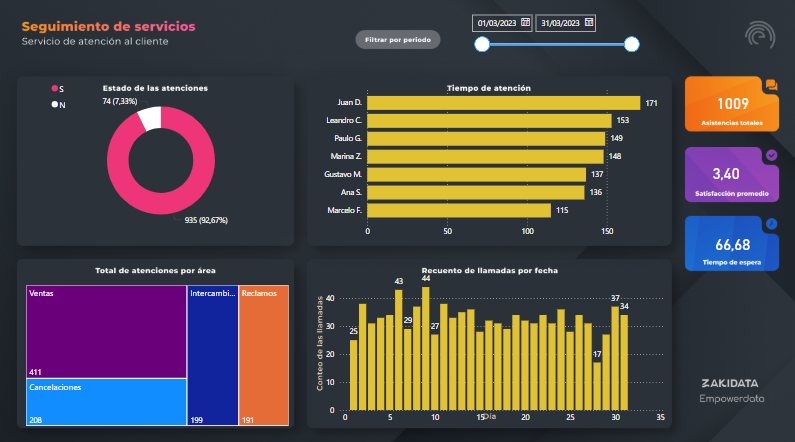

# 📊 Portafolio Power BI

Este repositorio contiene una colección de paneles de control desarrollados en **Power BI**. Los dashboards están enfocados en el análisis de **ventas, finanzas, producción y servicios**, aplicando técnicas de modelado de datos, DAX y visualizaciones interactivas para facilitar la toma de decisiones estratégicas.

---

## 📁 Dashboards Incluidos

### 1. 🧾 Resumen Financiero
Análisis general de indicadores financieros clave:
- Ingresos vs. egresos
- Margen de utilidad
- Análisis comparativo mensual

---

### 2. 💰 Dashboard de Ventas
Visualización del rendimiento de ventas por categoría, región y producto:
- Ventas por canal y cliente
- Top productos vendidos
- Tendencias mensuales

---

### 3. 🏭 Dashboard de Producción
Monitoreo de los procesos productivos:
- Comparativo entre producción esperada y real
- Costos de producción
- Eficiencia operativa

---

### 4. 🛠️ Dashboard de Seguimiento de Servicios
Panel diseñado para el análisis del servicio al cliente:
- Estado de las atenciones (S/N)
- Tiempo de atención por agente
- Distribución de solicitudes por área (ventas, reclamos, cancelaciones, etc.)
- Recuento de llamadas por fecha
- Indicadores de satisfacción, total de atenciones y tiempo de espera

---

## 🧠 Tecnologías Utilizadas

- Power BI Desktop  
- Power Query  
- Lenguaje DAX  
- SQL (consultas y modelado de datos)  
- Excel (como fuente de datos complementaria)  

---

## 📬 Contacto

**Andrés Felipe Díaz Campos**  
📧 pipediaz1234@gmail.com  
🌐 [LinkedIn](https://www.linkedin.com/in/andres-felipe-diaz-campos-398245207/)

---

💡 *Gracias por visitar mi portafolio. Si deseas colaborar, intercambiar ideas o tienes feedback sobre mis dashboards, estaré encantado de conectar contigo.*
