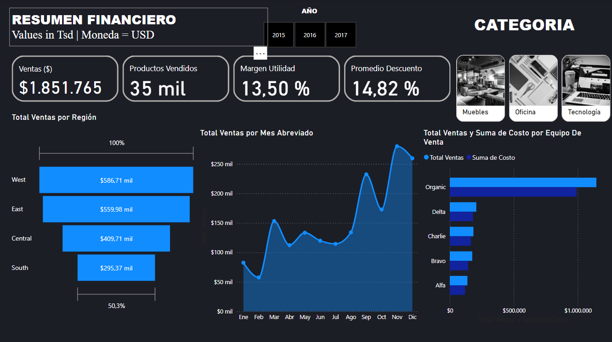
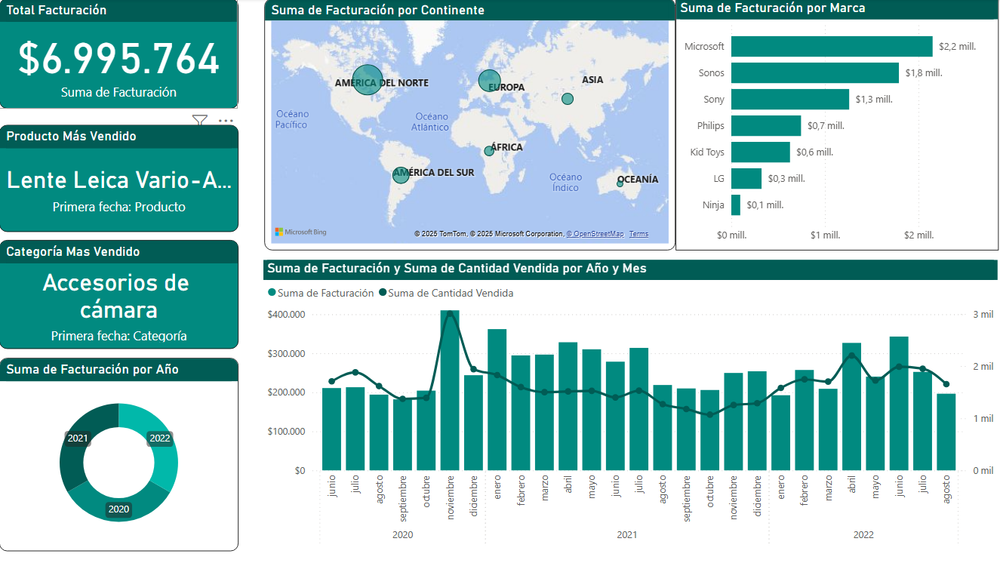
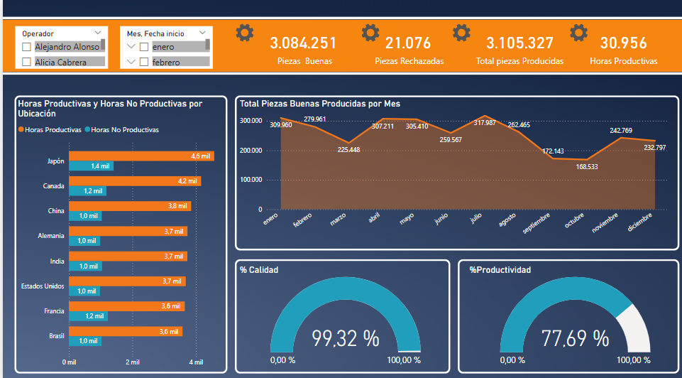
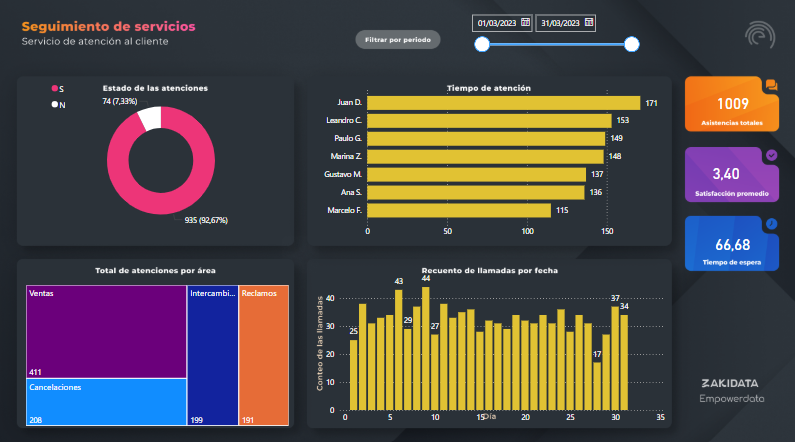
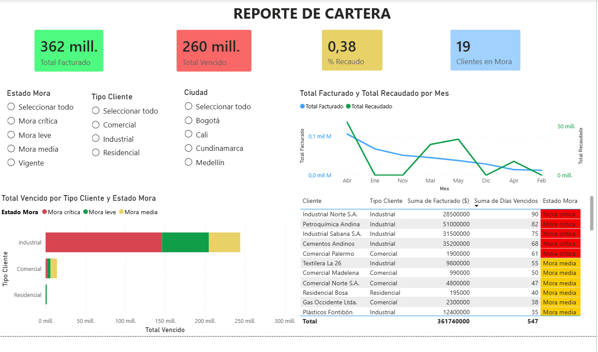

# 📊 Portafolio Power BI — Andrés Felipe Díaz Campos


> Colección de dashboards interactivos desarrollados en **Power BI**, orientados a la toma de decisiones estratégicas en áreas de **finanzas, ventas, producción, servicios y cartera**. Cada panel aplica modelado relacional de datos, transformaciones con Power Query y medidas avanzadas en DAX para entregar métricas accionables y visualizaciones de alto impacto.

---

## 📁 Dashboards Incluidos

---

### 1. 🧾 Resumen Financiero

**Objetivo:** Proveer una visión consolidada de la salud financiera de la organización, permitiendo identificar desviaciones entre ingresos y egresos y evaluar la rentabilidad en períodos comparativos.

**¿Qué muestra?**
- Ingresos totales vs. egresos totales con indicadores de variación
- Margen de utilidad neta y bruta
- Análisis comparativo mensual y acumulado
- Distribución del gasto por categoría

**Técnicas aplicadas:**
- Medidas DAX con `CALCULATE`, `SAMEPERIODLASTYEAR` para comparativos YoY
- Modelado estrella con tabla de fechas personalizada
- Formato condicional en tarjetas KPI según umbrales de alerta

**Resultado:** Reducción del tiempo de análisis financiero mensual, con visibilidad inmediata sobre los rubros de mayor impacto en la rentabilidad.



---

### 2. 💰 Dashboard de Ventas

**Objetivo:** Monitorear el rendimiento comercial por canal, producto y región, facilitando la identificación de oportunidades de crecimiento y clientes de alto valor.

**¿Qué muestra?**
- Ventas totales segmentadas por canal, cliente y categoría de producto
- Ranking de top productos y clientes por volumen de venta
- Tendencias de ventas mensuales con línea de meta
- Participación de mercado por región geográfica

**Técnicas aplicadas:**
- Medidas de ranking con `RANKX` y `TOPN`
- Segmentadores dinámicos con sincronización entre páginas
- Gráficos de barras, mapas y líneas con drill-down por jerarquía temporal

**Resultado:** Visibilidad en tiempo real del cumplimiento de metas comerciales, con capacidad de segmentar hasta nivel de cliente individual.



---

### 3. 🏭 Dashboard de Producción

**Objetivo:** Controlar la eficiencia de los procesos productivos comparando producción planificada vs. real, detectando cuellos de botella y optimizando el uso de recursos.

**¿Qué muestra?**
- Comparativo producción esperada vs. producción real por línea y período
- Costos de producción desglosados por insumo y proceso
- Indicadores de eficiencia operativa (OEE simplificado)
- Alertas visuales ante desviaciones críticas del plan

**Técnicas aplicadas:**
- Columnas calculadas con lógica condicional DAX para clasificar desviaciones
- Relaciones muchos-a-uno entre tablas de órdenes, productos y fechas
- Gráficos de velocímetro (gauge) y KPI cards con tendencia

**Resultado:** Identificación ágil de períodos con bajo rendimiento productivo, apoyando decisiones de reajuste de capacidad y recursos.



---

### 4. 🛠️ Dashboard de Seguimiento de Servicios

**Objetivo:** Analizar la gestión del servicio al cliente para mejorar tiempos de respuesta, identificar áreas de alta demanda y evaluar la satisfacción del usuario.

**¿Qué muestra?**
- Estado de las atenciones: resueltas vs. pendientes
- Tiempo promedio de atención por agente y por tipo de solicitud
- Distribución de solicitudes por área (ventas, reclamos, cancelaciones, soporte)
- Recuento de llamadas e interacciones por fecha
- Indicadores de satisfacción del cliente y tiempo de espera promedio

**Técnicas aplicadas:**
- Medidas de promedio ponderado con `AVERAGEX`
- Gráficos de anillo, barras apiladas y líneas de tendencia
- Filtros cruzados entre visualizaciones para análisis exploratorio

**Resultado:** Optimización del equipo de atención al identificar carga de trabajo desbalanceada entre agentes y picos de demanda por período.



---

### 5. 💳 Dashboard de Reporte de Cartera

**Objetivo:** Controlar la cartera vencida de clientes, clasificar el riesgo de mora y apoyar la gestión de cobro mediante priorización basada en datos.

**¿Qué muestra?**
- KPIs ejecutivos: Total Facturado (362M), Total Vencido (260M), % de Recaudo (0.38) y Clientes en Mora (19)
- Segmentadores interactivos por Estado de Mora (crítica, media, leve, vigente), Tipo de Cliente (industrial, comercial, residencial) y Ciudad
- Gráfico de líneas dual-eje: evolución mensual de Total Facturado vs. Total Recaudado
- Gráfico de barras apiladas: cartera vencida distribuida por tipo de cliente y estado de mora
- Tabla de clientes con Suma Facturada, Días Vencidos y clasificación de mora con formato condicional por semáforo de colores (rojo crítico, amarillo medio, verde leve)

**Técnicas aplicadas:**
- Medidas DAX con `SUMX`, `DIVIDE` y lógica de clasificación de mora por rangos de días vencidos
- Columnas calculadas para categorización automática del estado de mora
- Formato condicional basado en reglas aplicado a tabla de detalle
- Modelo relacional con tablas de clientes, facturas y fechas

**Resultado:** Reducción del tiempo de análisis de cartera, priorización efectiva de gestiones de cobro y visibilidad ejecutiva del riesgo financiero por segmento de cliente.



---

## 🧠 Tecnologías y Herramientas

| Herramienta | Uso |
|---|---|
| **Power BI Desktop** | Desarrollo de todos los dashboards e informes |
| **Power Query (M)** | Limpieza, transformación y carga de datos (ETL) |
| **DAX** | Medidas calculadas, KPIs, inteligencia de tiempo |
| **SQL** | Extracción y modelado de datos desde bases relacionales |
| **Excel** | Fuente de datos complementaria y validación de cifras |

---

## 🗂️ Estructura del Repositorio

```
Portafolio-PowerBI/
│
├── dashboard Reporte de Cartera.pbix
├── Dashboard Financiero.pbix
├── dasboard Resumen Financiero.pbix
├── dasboard ventas tech.pbix
├── dashboar seguimiento de servicios.pbix
├── dashboard produccion.pbix
│
├── dashboard_Cartera.png
├── dashboard_Resumen_financiero.png
├── dashboard_Ventas.png
├── dashboard_Produccion.png
├── dashboard_Servicios.png
├── dashboard_financiero.png
│
└── README.md
```

---

## 📬 Contacto

**Andrés Felipe Díaz Campos**
Estudiante de Ingeniería de Sistemas — Universidad de Cundinamarca
Especialización en análisis de datos, Power BI y administración de bases de datos

📧 pipediaz1234@gmail.com
🌐 [LinkedIn](https://www.linkedin.com/in/andres-felipe-diaz-campos-398245207/)
💼 [GitHub](https://github.com/pipediaz1234)

---

> 💡 *Si este portafolio te resulta útil o deseas colaborar, no dudes en conectar. Siempre abierto a feedback, nuevos proyectos y oportunidades en el mundo del análisis de datos.*
